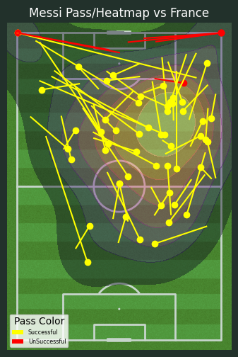
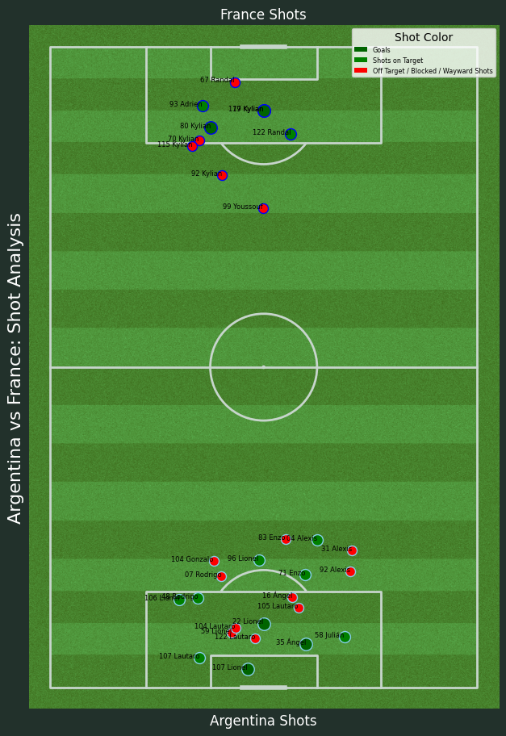

# Advanced Data Visualizations in Soccer - FIFA World Cup 2022 Final Analysis

## Project Overview

This project utilizes Python to create sophisticated and informative data visualizations, with a specific focus on the FIFA World Cup 2022 final between Argentina and France. Recognized for its intense gameplay and historical significance, this match provided a rich dataset for detailed analysis.

### Key Highlights

- **Match Focus**: Centered on the FIFA World Cup 2022 final, the project explores the nuances of one of the most thrilling matches in recent soccer history.
- **Data Retrieval Challenges**: The project overcame challenges in data acquisition by utilizing StatsBomb, a leading provider of soccer data. Python's `requests` library was employed to retrieve accurate and comprehensive datasets.
- **Visualization Techniques**: Employing the `mplsoccer` library, the project features a detailed visualization of the soccer pitch. This innovative approach enhanced the representation of game statistics and player movements.

### Project Significance

This project sheds light on key statistics and dynamics of a landmark soccer final. By harnessing Python's data processing and visualization capabilities, it offers valuable insights into player performances and game strategies. It serves as a critical tool for soccer analysts and enthusiasts, providing a deeper understanding of the beautiful game.

### 1) Python code to gather the required data from StatsBomb---> https://github.com/Heysen3101/Soccer_Analytics/blob/main/Statsbombimport.ipynb

### 2) Python code to visualize Messi's Passes and HeatMap---> https://github.com/Heysen3101/Soccer_Analytics/blob/main/Heatmap.ipynb

### 3 a) Python code to gather the Shots data from StatsBomb---> https://github.com/Heysen3101/Soccer_Analytics/blob/main/GatherShotsData.ipynb
###   b) Python code to visualize Argentina and France Shots---> https://github.com/Heysen3101/Soccer_Analytics/blob/main/Shotschart.ipynb

